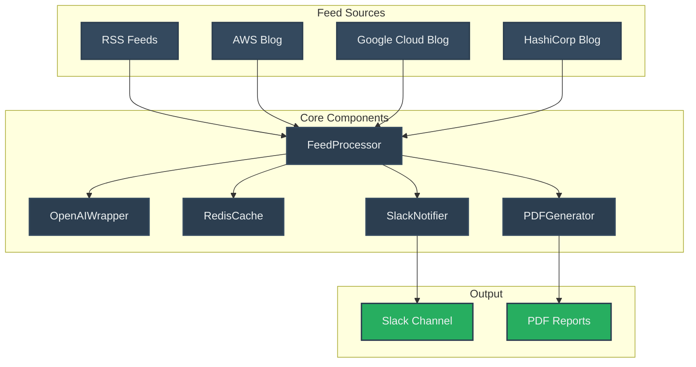
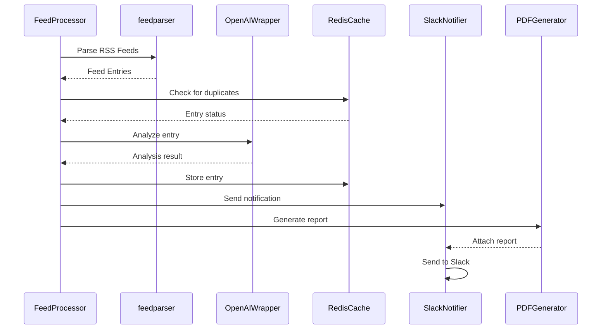
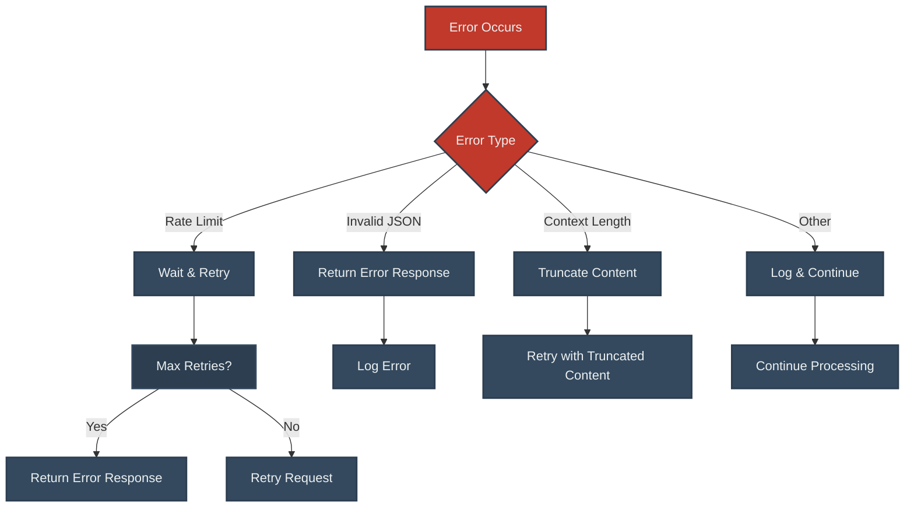

# Hermes Project Architecture

## System Overview

## Component Details

### FeedProcessor
- Main orchestrator of the system
- Handles feed parsing and entry processing
- Manages the flow of data between components
- Implements keyword filtering and entry deduplication

### OpenAIWrapper
- Interfaces with OpenAI's API
- Analyzes feed entries for breaking changes
- Provides structured analysis in JSON format
- Handles rate limiting and retries

### RedisCache
- Stores processed entries
- Prevents duplicate processing
- Maintains entry history
- Enables quick lookups

### SlackNotifier
- Sends notifications to Slack
- Formats messages with important information
- Attaches PDF reports
- Handles error notifications

### PDFGenerator
- Creates detailed PDF reports
- Formats entry data for readability
- Includes analysis and deadlines
- Generates summary reports

## Data Flow

## Configuration

The system is configured through environment variables:

- `OPENAI_API_KEY`: OpenAI API key
- `RSS_FEEDS`: Comma-separated list of feed URLs
- `DEFAULT_KEYWORDS`: Keywords to filter entries
- `BREAKING_CHANGE_TARGETS`: Tech stack components to monitor
- `REDIS_HOST`: Redis server hostname
- `REDIS_PORT`: Redis server port
- `REDIS_PASSWORD`: Redis server password
- `SLACK_BOT_TOKEN`: Slack bot token
- `SLACK_CHANNEL`: Target Slack channel

## Error Handling

## Monitoring and Logging

The system uses Python's logging module with the following levels:
- DEBUG: Detailed information for debugging
- INFO: General operational information
- WARNING: Warning messages for potential issues
- ERROR: Error messages for failed operations

Each component logs its operations and errors, making it easy to track the system's behavior and diagnose issues. 